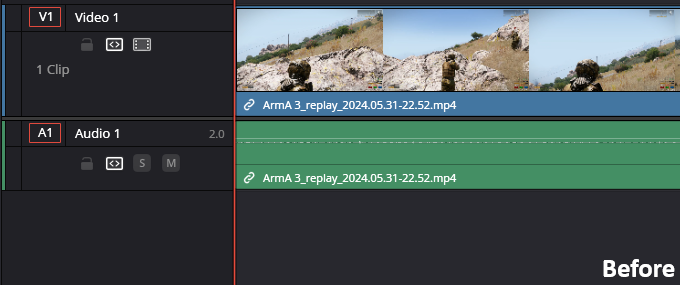
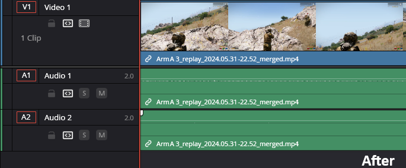

# Relive Track Merger

The `Relive Track Merger` is a tool designed to **embed microphone tracks into Radeon Relive replays**.
By automating this process, it eliminates the hassle of managing separate media files during video editing,
especially when handling large collections of replays. The application uses `FFmpeg` as a CLI tool to add the microphone track to the replay.

The tool offers two ways of processing: 

1. **Saving processed replays to a separate output folder** (`replays_merged`), preserving the original replays
2. **Replacing the original replays** with processed ones directly in their current location

Choosing to process the replays to a separate output folder is highly recommended to
ensure the original replays remain intact and are not replaced by potentially corrupt files.



-


## Prerequisites

- **Java**:  
  Required to launch the .jar file. You can download Java [here](https://www.java.com/download/ie_manual.jsp). <br>
  To check if Java is installed, open cmd and run:
    ```bash
      java -version
    ```

- **FFmpeg**:  
  FFmpeg handles the core task of adding the microphone track to the replay. If not installed, the app can automatically install it using
  the [Windows Package Manager (winget)](https://learn.microsoft.com/en-us/windows/package-manager/winget).
  Alternatively, you can manually install FFmpeg from its [official website](https://ffmpeg.org/download.html). <br>
  To verify ffmpeg is installed, run:
    ```bash
      ffmpeg -version
    ```
## How It Works

1. **Select Input Folder** <br>
   Choose the directory where your replays are stored. You can select a specific game folder (e.g.,
   `Radeon Relive\ArmA 3`) or the entire `Radeon Relive` directory to process all replays.

2. **Select Output Folder** <br>
   Define where the processed replays will be saved. By default, the output directory is set to
   `INPUT_FOLDER\replays_merged`. The directory structure of the output folder will remain identical to the input folder, meaning that your processed replays will be separated by game.
   If you prefer to overwrite the original files, the output folder option will be disabled.

3. **Process Files** <br>
   Click the `Process` button to start embedding microphone tracks into corresponding replays. Files without a matching
   microphone track will either be copied or left untouched based on your settings.

**File Identification**:

- **Replays**: `.mp4` files with `_replay_` in their filename.
- **Microphone Tracks**: `.m4a` files with the same name as their corresponding replay, located in the same directory.
- **Already Processed Files**: Files ending with `_merged` are excluded automatically from the processing.

# Disclaimer

This application was developed as a personal project and is provided "as is".
While it has been tested, there is a risk of unexpected issues or file corruption.
Please use it at your own discretion and back up your files before using the app.
Contributions and suggestions for improvements are welcome!