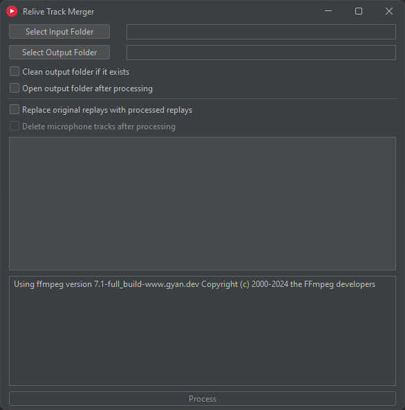

# Relive Track Merger

The `Relive Track Merger` is a lightweight desktop application designed to **embed microphone tracks of Radeon Relive replays into the replays themselves**, a feature that has long been present in Nvidia Shadowplay. This makes the process of having to import 2 different media onto a video editing timeline obsolete, especially if your media pool contains hundreds of replays and microphone tracks. The application uses `FFmpeg` as a CLI tool to add the microphone track to the replay. 

## Prerequisites
- **Java**:  
  You need to have Java installed on your computer to launch the .jar file. You can download Java [here](https://www.java.com/download/ie_manual.jsp).
- **FFmpeg**:  
  FFmpeg is required to merge the replay and the microphone track. If you don't have it installed, the application will prompt you to install it for you using the [Windows Package Manager (winget)](https://learn.microsoft.com/en-us/windows/package-manager/winget).
  Alternatively, you can manually install FFmpeg from its [official website](https://ffmpeg.org/download.html).

## How It Works

1. Click the `Select Input Folder` button to choose the directory where your replays are located. You can choose your whole `Radeon ReLive` folder if you want to process all of your replays, or you can choose just one folder (for example: `Radeon ReLive\ArmA 3`) if you want to process replays of just one game.
2. Click the `Select Output Folder` button to choose the directory where you want to save the processed replays. The default output location of the processed replays is always set at `_InputFolder_\replays_merged`, but you can change it by clicking on the `Select Output Folder` button and choosing a different location. The output folder should retain the same directory structure as the input directory, so your game replays will remain separated. So, for example, `ArmA 3` replays will be located under `replays_merged\ArmA 3` and so on.  
   Selecting an output folder will be disabled if you choose to replace the original source replays as the input folder is the same as the output folder.
3. Click the `Process` button to start the task of merging microphone tracks into the corresponding replay.

**Notes**:
  - Replays are identified as `.mp4` files with `_replay_` in their filenames. Replays that have already been processed (those whose filenames end in `_merged`) are automatically excluded.
  - A microphone track is identified as a file located in the same directory as a replay, sharing the same file name as the replay but with the `.m4a` extension. If no matching microphone track is found, the replay will be copied to the output directory. If you choose to replace the original replays with processed ones, replays without a microphone track will be untouched.

# Disclaimer

This application was created as a personal project and was meant to be used just by me and my friends.
It might have bugs, may permanently corrupt your replays and may not work as intended.
Use it at your own risk. Contributions and improvements are always welcome.