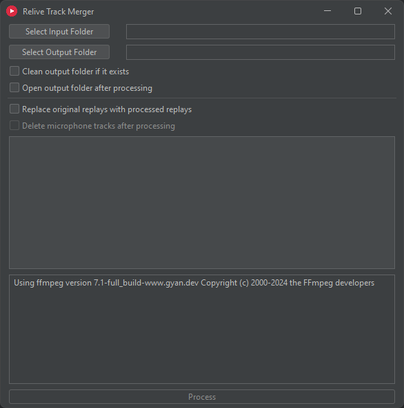
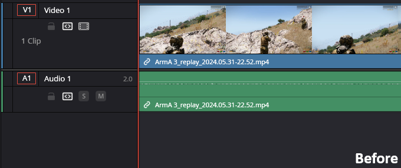
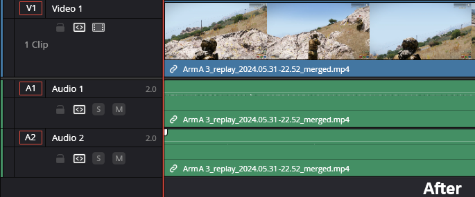

# Relive Track Merger

Relive Track Merger embeds microphone (.m4a) tracks into Radeon Relive replay (.mp4) files using FFmpeg.
It automates merging many replays, keeping folder structure intact and giving you the option to either
preserve originals or overwrite them.

## Why use this tool

- Saves time when preparing many replays for editing.
- Keeps processed replays organized by game (output mirrors input structure).
- Lets you choose between preserving originals or replacing them in-place.

## Screenshots







## Quick summary

- **Replays**: .mp4 files with `_replay_` in the filename.
- **Microphone tracks**: .m4a files with the same basename as their replay, located in the same folder.
- Already processed files end with `_merged` and are skipped automatically.

## Default behavior

- When you select an input folder, the default output folder becomes `INPUT_FOLDER/replays_merged`.
- If you enable "Replace originals" the output folder is the input folder itself and the output selection is disabled.
- If you select a custom output folder, the app will use `SELECTED_FOLDER/replays_merged` unless you are replacing originals.

## Examples

- Input: `C:\Radeon Relive\ArmA 3`, Replace originals: OFF → Output: `C:\Radeon Relive\ArmA 3\replays_merged`
- Input: `C:\Radeon Relive\ArmA 3`, Replace originals: ON → Output: `C:\Radeon Relive\ArmA 3`
- Selected output `C:\Processed` (Replace originals OFF) → Output: `C:\Processed\replays_merged`
- If you choose a folder already named `replays_merged`, the app will not append another `replays_merged` segment.

## Prerequisites

- **Java** (to run the jar). Check with:

  ```powershell
  java -version
  ```

- **FFmpeg**. The app will attempt to install FFmpeg on Windows via `winget` if it is not installed. Alternatively, install it manually:

  ```powershell
  ffmpeg -version
  ```

## Usage

1. Start the app (run the JAR or use the launcher).
2. Click "Select Input Folder" and choose your replay root or a specific game folder.
3. Optionally, click "Select Output Folder" (disabled if "Replace originals" is selected).
4. Toggle "Replace originals" if you prefer to overwrite original replay files.
5. Optionally, toggle "Clean output folder" to remove previously processed files before running.
6. Click "Process". Progress and status messages appear in the log area.

## Processing details and safety notes

- The app uses FFmpeg to combine streams. When replacing originals, temporary files are created and then moved into place — this reduces but does not eliminate the risk of corruption. Back up important files before use.
- Files without a matching microphone track are either copied to the output or left untouched depending on the "Replace originals" setting.
- If you pick an output directory that does not exist, the app will create the necessary folders.

## Troubleshooting

- If processing fails due to insufficient free space, try freeing disk space or selecting a different output drive.
- If FFmpeg is missing and automatic installation fails, install FFmpeg manually and ensure it is on your PATH.

## License & disclaimer

This is a personal project provided "as is". Use at your own risk and back up your data before running bulk operations. Contributions and suggestions are welcome.